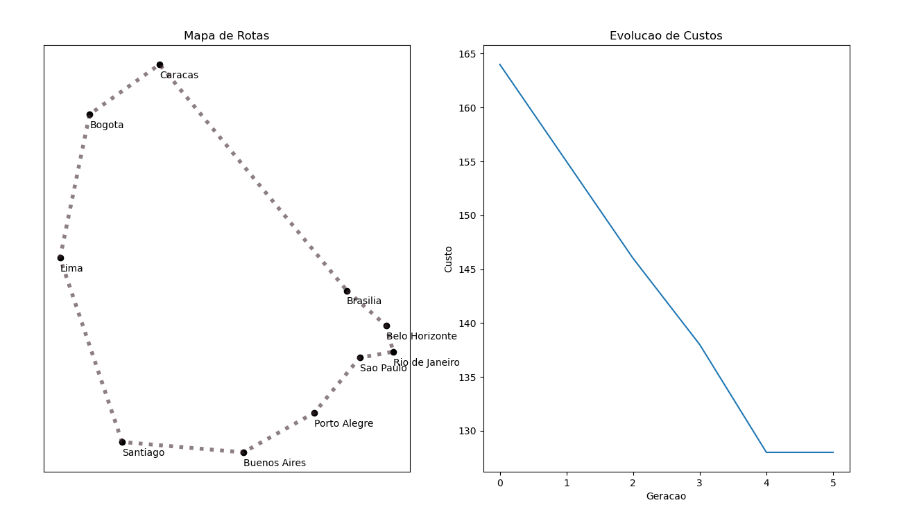

# Problema do Caixeiro Viajante com  Algoritmo Genético
Esta implementação soluciona uma instância do problema do caixeiro viajante, em que a rota começa e termina sempre na cidade de Brasília.

[[file:diagrams/uruguay.gif]]

<!--stackedit_data:
eyJoaXN0b3J5IjpbMTAzNjcyMjQ4MiwtNDczMjg3Nzc4LDM0MD
IwNTcwMyw3MzA5OTgxMTZdfQ==
-->